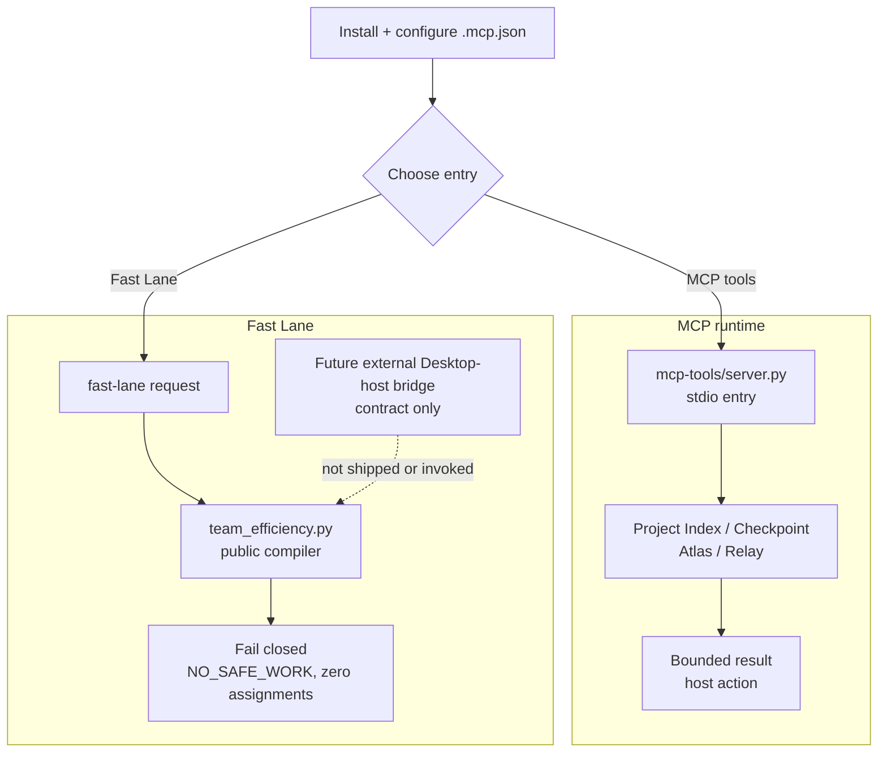

[简体中文](README.zh-CN.md)

# 2718lab DevKit — Codex + MCP v1.1.0

2718lab DevKit is a Codex-first engineering toolkit: a local, stdio-only MCP
runtime for bounded project indexing, Atlas evidence, Relay lifecycle
coordination, and deterministic Fast Lane planning, plus a compact Skill bundle
of reference manuals. This repository carries the versioned v1.1.0 package.
The checked-in manifest and allowlist define the executable runtime surface;
the manual map, install, build, and verification sections below describe the
supported workflow.

The current release retains a deliberately fail-closed Fast Lane preview. The public compiler
and CLI return `NO_SAFE_WORK` with zero assignments: they do not consume host
status or live-account inputs, and have no worktree execution path. Host
execution remains an external Desktop-host bridge requirement.

> [!IMPORTANT]
> **Workflow reminder:** route from bounded evidence. Parallel A1/A2/A3 work is
> allowed only with disjoint, exclusively owned write scopes and independent G:
> task roots. Claim and bind before execution; prewarm is read-only and
> `action="retain"` is not a new spawn. The coordinator integrates only after
> PR-style independent review, then accepts before archiving. Fast Lane does not
> use an account-usage coordinator or account-usage inputs. Do not commit runtime state or
> credentials.

> **Scheduler topology V1:** `2718lab-devkit/scheduler-topology-v1` binds the
> plan, lease, and G-drive worktree as auditable opaque identities. A/B/C means
> main-conversation review/integration, scheduler, and writer; each scheduler
> has at most a 1:3 writer relationship. Design/prewarm are read-only and stay
> subject to actual host slots, host capability, and safety gates. Cross-scope
> work requires a declared-child split that strictly reduces conflict, or is
> UNSPLITTABLE.

## What is shipped

- Project Index exposes opaque workspace registration, bounded snapshots,
  status, and graph queries.
- Checkpoint services create, inspect, and restore evidence-bound snapshots.
- Atlas provides bounded graph queries, packet preparation, inert rendering,
  and durable acceptance projection.
- Relay validates explicit work packages and exposes lifecycle state. Python
  returns structured host actions; the Codex host remains responsible for
  worktree bootstrap and agent dispatch.
- The executable MCP runtime exposes exactly 17 tools, no MCP prompts, no MCP
  resources, no static prompt agents, and no model runner.
- The optional Codex Skill bundle is part of DevKit's documentation surface. It
  provides short, module-specific manuals without becoming a second runtime or
  an executable prompt/agent surface.
- Fast Lane is a pure MCP runtime compiler. Its public surface is presently
  authority-inert and fail-closed: it emits no assignments and never spawns
  agents, edits Git, runs commands, or executes worktrees. Host execution is
  reserved for a future external Desktop-host bridge contract. The RuntimeRoot
  host-private V2/V3 bootstrap path is covered with injected test doubles only;
  no external host embedding or operational/host-integrated GO is claimed.

## Module overview

| Module | Responsibility | Start here |
| --- | --- | --- |
| [`mcp-tools/server.py`](mcp-tools/server.py) | stdio MCP entry point and the public 17-tool surface | [MCP surface](#exact-mcp-surface) |
| [`mcp-tools/project_index/`](mcp-tools/project_index/) | workspace registration, bounded snapshots, status, and graph queries | [Project Index tools](#exact-mcp-surface) |
| [`mcp-tools/devkit_atlas/`](mcp-tools/devkit_atlas/) | evidence graph queries, implementation packets, rendering, and acceptance projection | [Atlas tools](#exact-mcp-surface) |
| [`mcp-tools/devkit_relay/`](mcp-tools/devkit_relay/) | explicit work-package compilation and lifecycle host actions | [Relay tools](#exact-mcp-surface) |
| [`mcp-tools/devkit_runtime/`](mcp-tools/devkit_runtime/) | runtime paths, checkpoints, durable boundaries, and the private host bridge | [runtime and recovery](#runtime-data-and-recovery) |
| [`mcp-tools/orchestrator/`](mcp-tools/orchestrator/) | durable workflow, task, lease, and lifecycle state | [workflow lifecycle](mcp-tools/devkit_fastlane/references/efficiency-automation.md#workflow-lifecycle-plan) |
| [`mcp-tools/devkit_fastlane/`](mcp-tools/devkit_fastlane/) | deterministic routing/Fast Lane compiler, contracts, and tests | [Fast Lane contract](mcp-tools/devkit_fastlane/FASTLANE_CONTRACT.md) |
| [`.codex-plugin/`](.codex-plugin/) | plugin manifest, artifact allowlist, and reproducible package builder | [artifact build](#build-the-primary-artifact) |

## Overall workflow

The repository workflow defaults to Fast Lane. `workflow-design` prepares a
bounded input; `fastlane_compile` or `team_efficiency.py` then returns an
authority-inert, fail-closed plan. `fast-lane-routing` documents the intended
future host-consumption boundary; neither a skill nor the current compiler
starts agents or creates/executes cross-session worktrees. The current path is
to inspect the blocked plan and retain authority outside this repository.

## Codex manual map

DevKit deliberately has two separate surfaces: the MCP runtime performs
bounded tool work, while the local plugin includes an optional,
documentation-only Codex manual bundle. The bundle has one short navigator
(`skills/devkit-overview`), one workflow-design manual (`skills/workflow-design`,
default Fast Lane policy), and six separate module manuals. A task loads only
the manual it needs:

`fast-lane-routing` · `bugkiller` · `code-atlas` ·
`mcp-server-dev` · `oss-repo-ops` · `python-engineering`.

These skills are reference manuals, not MCP tools or executable prompt surfaces.
They contain no slash commands, agent profiles, starter templates, validators,
or dispatch code. The lean runtime ZIP deliberately excludes them, but that
packaging boundary does not make DevKit a runtime-only product.

## Documentation map

Use this page as the entry point, then follow the contract links instead of
re-reading the whole repository:

- [Fast Lane contract](mcp-tools/devkit_fastlane/FASTLANE_CONTRACT.md)
- [Efficiency automation reference and CLI details](mcp-tools/devkit_fastlane/references/efficiency-automation.md)
- [Verification checklist](mcp-tools/devkit_fastlane/references/verification-checklist.md)
- [Work-package and task-card rules](mcp-tools/devkit_fastlane/references/work-packages.md)
- [Orchestration runtime contract](mcp-tools/devkit_fastlane/references/orchestration-runtime.md)
- [Team and lane patterns](mcp-tools/devkit_fastlane/references/team-patterns.md)
- [Repository automation and review](docs/governance/repository-automation.md)
- [Contributing](CONTRIBUTING.md) · [Security reporting](SECURITY.md) · [Code of Conduct](CODE_OF_CONDUCT.md)
- [Historical design records](docs/superpowers/README.md) — context only; they can mention
  retired components and are not the current implementation contract.
- [Release history](CHANGELOG.md)

For the current implementation entry point, see
[the Fast Lane compiler](mcp-tools/devkit_fastlane/scripts/team_efficiency.py).
Fast Lane has no account-usage coordinator contract; the public compiler and
CLI do not read, coordinate, or infer account usage.

## Exact MCP surface

The public server name is 2718lab-devkit. Every result uses the bounded
2718lab-devkit/tool-result-v1 envelope. The public surface is exactly:

| Area | Tools |
| --- | --- |
| Project Index | project_index_register, project_index_sync, project_index_status, project_index_query |
| Checkpoints | worktree_checkpoint_create, worktree_checkpoint_status, worktree_checkpoint_restore |
| Atlas | atlas_query, atlas_prepare, atlas_render, atlas_accept |
| Relay | relay_compile, relay_start, relay_status, relay_handoff, relay_integrate |
| Fast Lane | fastlane_compile |

The server has no prompt or resource surface. Tool inputs are structured and
bounded; absolute worker paths, shell fragments, raw source, credentials,
unbounded command output, and caller-forged acceptance evidence are rejected.

## Install and run locally

Requirements: Python 3.11 or newer and uv.

From the repository root:

    cd mcp-tools
    uv sync --locked --no-dev
    uv run --locked --no-dev python server.py

The canonical host configuration is .mcp.json. It runs the locked command
above with mcp-tools as the working directory. The configuration forwards two
private host-bridge selector names and optional project/thread scope identifiers:

- CODEX_DEVKIT_HOST_BRIDGE_FD
- CODEX_DEVKIT_HOST_BRIDGE_HANDLE
- CODEX_PROJECT_ROOT, CODEX_WORKSPACE_ROOT
- CODEX_PROJECT_ID, CODEX_WORKSPACE_ID, CODEX_THREAD_ID

These are selector or identity names, not values to invent or copy into a task
message. The latter identifiers keep durable state scoped to one project or
thread instead of leaking it into another workspace.
Relay lifecycle mutations that need the private host capability broker or proof
registry fail closed when the host does not provide an attested capability,
using RELAY_CAPABILITY_BROKER_UNAVAILABLE. The server never exposes raw
handles or falls back to an unrelated local start.

## Build the primary artifact

The allowlisted builder creates a deterministic ZIP outside the plugin source
tree. Choose an output directory outside the source tree:

    python .codex-plugin/build_main_artifact.py --plugin-root . --output <artifact-output-dir>/2718lab-devkit-v1.1.0.zip

The artifact contains the manifest, .mcp.json, LICENSE, the locked Python
project, and the runtime files selected by
.codex-plugin/main-artifact-allowlist.json. Its executable runtime surface is
the MCP server; the ZIP also carries the Fast Lane contract, required references
and policy assets, the `team_efficiency.py` compatibility entry point, its
routing modules. It deliberately excludes the optional Skill manual bundle, command
helpers, hooks, CI files, host-private state, prompts, static agents, and
arbitrary repository files.

Run Fast Lane through its executable entry point to inspect its fail-closed
result:

    python mcp-tools/devkit_fastlane/scripts/team_efficiency.py fast-lane --input <fast-lane-request.json> --reasoning-effort ultra

Legacy host-only switches remain parse-compatible only. The current public CLI
does not read or consume them and cannot activate work. It has no account-usage
coordinator or cache contract.

`CODEX_FASTLANE_TASK_ROOT` and worktree/cache placement are likewise reserved
for a future host-owned execution bridge. The current public compiler neither
creates nor executes a worktree and must not be used as evidence that a
worktree configuration has been accepted.

## Runtime data and recovery

Persistent data is local. RuntimeConfig resolves the data root in this order:

1. `CODEX_DEVKIT_DATA_ROOT`, when the host explicitly provides an absolute
   directory for this installation.
2. PLUGIN_DATA, when the host explicitly provides an absolute directory.
3. CODEX_HOME/data/2718lab-devkit.
4. The default Codex data directory:
   %USERPROFILE%\.codex\data\2718lab-devkit.

For a portable local installation, set `CODEX_DEVKIT_DATA_ROOT` to a durable
G: path (for example `G:\CodexData\.codex\data\2718lab-devkit`). This
override is intentionally separate from the legacy `PLUGIN_DATA` root so an
older checkout cannot open the stable runtime's database by accident.

When the host provides CODEX_PROJECT_ROOT or CODEX_WORKSPACE_ROOT, the durable
root is further scoped below `scoped-v1` by a SHA-256 identity of that project
root. If a project root is unavailable, CODEX_PROJECT_ID, CODEX_WORKSPACE_ID,
or CODEX_THREAD_ID provides a non-path fallback scope. The raw project path or
identity is never written into the scope directory name. This prevents a
long-lived plugin process from projecting one project's workflows, indexes, or
receipts into another project. A command-line invocation with no scope keeps
the unsuffixed root for backwards compatibility; the host integration should
always provide a project or thread scope.

For local DevKit work, set CODEX_TASK_TEMP and its TMPDIR/TEMP/TMP/
PYTHONPYCACHEPREFIX children under an isolated G: task root. A configured
scratch base receives the same scope suffix as durable data. The runtime rejects
unsafe, overlapping, missing, or reparse-point roots and does not write fallback
state into the repository. Hosted Windows CI is the explicit exception: its
workflow must require RUNNER_TEMP and derive CODEX_TASK_TEMP plus all task-local
temporary/cache children below it. That host-provided exception does not prove
an external host embedding.

After a host interruption, resume from the durable workflow lease, endpoint,
artifact references, snapshots, and bounded receipts. Rebind a valid current
context before continuing. Do not reconstruct authority from chat history,
raw logs, or an unrelated new start. Archive a completed independent task only
after evidence, commit, integration, and acceptance have all succeeded.

## Deterministic Fast Lane

The Fast Lane compiler is in
mcp-tools/devkit_fastlane/scripts/fastlane_routing.py and
mcp-tools/devkit_fastlane/scripts/team_efficiency.py. The public MCP entry is
`fastlane_compile`; every current invocation is deliberately blocked with
`NO_SAFE_WORK` and zero assignments.

- `ultra` and `--enable` only select the shape of the blocked result; they do
  not activate scheduling.
- The public compiler/CLI does not consume host status, account usage, index
  evidence, or a worktree root.
- It never dispatches a session, creates a worktree, refills a slot, or runs a
  command. No in-repository execution path exists for those actions.
- An external Desktop-host bridge may later provide attested project authority
  and execution. That is a future contract, not a
  shipped implementation or a claim that any Desktop host source exists.

### Account-usage boundary

Account usage is not a Fast Lane input or routing mechanism. This release has
no account-usage coordinator, cache, or external collector contract.

## Safety and scope boundaries

- Atlas is deterministic and local. It cannot currently connect to third-party
  sources; it does not call an LLM, vector store, network service, shell, or
  patch applier.
- Relay compiles explicit packages and returns host actions; it does not
  fabricate successful spawns. The host owns the actual Codex dispatch.
- Worktree, branch, lease, task, snapshot, receipt, and evidence identities
  are bound and fail closed on stale, forged, cross-workflow, or conflicting
  input.
- stdio stdout is protocol-only. Diagnostics go to stderr.
- Runtime data, task scratch, worktrees, caches, and verification evidence
  remain local and bounded.

## Verification

Run the release verification from the revision being built:

    cd mcp-tools
    uv run --locked pytest -q
    uv lock --check
    uv run --locked ruff check devkit_atlas/service.py devkit_continuity devkit_runtime/atlas_acceptance.py orchestrator/service.py project_index/checkpoints.py project_index/service.py project_index/store.py
    uv run --locked python -m compileall -q devkit_atlas devkit_continuity devkit_runtime orchestrator project_index

CI and fresh-artifact checks are the source of truth for current test counts.
They verify the exact 17-tool inventory, empty prompt/resource lists,
protocol-clean stdout, normal and rejected calls, missing-host capability
failure, and source-checkout independence. This README intentionally does not
freeze a transient regression count.

## Version

This repository represents the versioned v1.1.0 package. Release notes are
in [CHANGELOG.md](CHANGELOG.md); build and install from the checked-in manifest,
artifact allowlist, and locked dependency set. A maintainer dispatches Release
from current `main`; it validates all declared gates, creates the annotated tag,
and publishes the matching GitHub Release. Pushing a tag alone does not publish.

## License

[AGPL-3.0](LICENSE).
