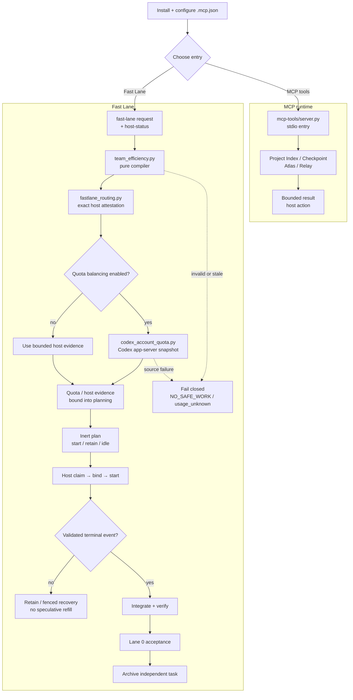

[简体中文](README.zh-CN.md)

# 2718lab DevKit — Codex + MCP v1.0.0-rc4

[](./.codex-plugin/plugin.json)
[](LICENSE)

2718lab DevKit is a Codex-first engineering toolkit: a local, stdio-only MCP
runtime for bounded project indexing, Atlas evidence, Relay lifecycle
coordination, and deterministic Fast Lane planning, plus a compact Skill bundle
of reference manuals. This repository carries the versioned v1.0.0-rc4 package.
The checked-in manifest and allowlist define the executable runtime surface;
the manual map, install, build, and verification sections below describe the
supported workflow.

RC4 retains a fail-closed Host-contract preview. It does not create Desktop
sessions: without a Host-private verifier, intent admission returns
`NO_SAFE_WORK`.

> [!IMPORTANT]
> **Workflow reminder:** route from bounded evidence, keep one writer per
> write scope, claim and bind before execution, refill only after a validated
> terminal event, integrate and accept before archiving. Prewarm is read-only;
> `action="retain"` is not a new spawn. Keep task scratch, caches, worktrees,
> and evidence in an isolated user-owned workspace; configure quota sample
> storage explicitly when needed. Do not commit runtime state or credentials.

## What is shipped

- Project Index exposes opaque workspace registration, bounded snapshots,
  status, and graph queries.
- Checkpoint services create, inspect, and restore evidence-bound snapshots.
- Atlas provides bounded graph queries, packet preparation, inert rendering,
  and durable acceptance projection.
- Relay validates explicit work packages and exposes lifecycle state. Python
  returns structured host actions; the Codex host remains responsible for
  worktree bootstrap and agent dispatch.
- The executable MCP runtime exposes exactly 17 tools, no MCP prompts, no MCP
  resources, no static prompt agents, and no model runner.
- The optional Codex Skill bundle is part of DevKit's documentation surface. It
  provides short, module-specific manuals without becoming a second runtime or
  an executable prompt/agent surface.
- Fast Lane is a pure MCP runtime compiler. It selects explicit model/effort
  routes from bounded difficulty and host capability evidence; it never spawns
  agents, edits Git, or runs commands. Host-private quota and lifecycle
  attestations stay outside the public request.

## Module overview

| Module | Responsibility | Start here |
| --- | --- | --- |
| [`mcp-tools/server.py`](mcp-tools/server.py) | stdio MCP entry point and the public 17-tool surface | [MCP surface](#exact-mcp-surface) |
| [`mcp-tools/project_index/`](mcp-tools/project_index/) | workspace registration, bounded snapshots, status, and graph queries | [Project Index tools](#exact-mcp-surface) |
| [`mcp-tools/devkit_atlas/`](mcp-tools/devkit_atlas/) | evidence graph queries, implementation packets, rendering, and acceptance projection | [Atlas tools](#exact-mcp-surface) |
| [`mcp-tools/devkit_relay/`](mcp-tools/devkit_relay/) | explicit work-package compilation and lifecycle host actions | [Relay tools](#exact-mcp-surface) |
| [`mcp-tools/devkit_runtime/`](mcp-tools/devkit_runtime/) | runtime paths, checkpoints, durable boundaries, and the private host bridge | [runtime and recovery](#runtime-data-and-recovery) |
| [`mcp-tools/orchestrator/`](mcp-tools/orchestrator/) | durable workflow, task, lease, and lifecycle state | [workflow lifecycle](mcp-tools/devkit_fastlane/references/efficiency-automation.md#workflow-lifecycle-plan) |
| [`mcp-tools/devkit_fastlane/`](mcp-tools/devkit_fastlane/) | deterministic routing/Fast Lane compiler, quota snapshot collection, contracts, and tests | [Fast Lane contract](mcp-tools/devkit_fastlane/FASTLANE_CONTRACT.md) |
| [`.codex-plugin/`](.codex-plugin/) | plugin manifest, artifact allowlist, and reproducible package builder | [artifact build](#build-the-primary-artifact) |

## Overall workflow

The repository workflow defaults to Fast Lane. `workflow-design` prepares the
bounded input; the host then calls `fastlane_compile` or `team_efficiency.py`
to compile an inert plan. `fast-lane-routing` is the host-consumption guide:
neither a skill nor the compiler starts agents or creates cross-session
worktrees. The short path is:

configure the host, choose the MCP or Fast Lane entry, compile a bounded plan,
let a capable host execute only fenced descriptors, and close the lifecycle
with terminal evidence, integration, acceptance, and archive.



## Codex manual map

DevKit deliberately has two separate surfaces: the MCP runtime performs
bounded tool work, while the local plugin includes an optional,
documentation-only Codex manual bundle. The bundle has one short navigator
(`skills/devkit-overview`), one workflow-design manual (`skills/workflow-design`,
default Fast Lane policy), and six separate module manuals. A task loads only
the manual it needs:

`fast-lane-routing` · `bugkiller` · `code-atlas` ·
`mcp-server-dev` · `oss-repo-ops` · `python-engineering`.

These skills are reference manuals, not MCP tools or executable prompt surfaces.
They contain no slash commands, agent profiles, starter templates, validators,
or dispatch code. The lean runtime ZIP deliberately excludes them, but that
packaging boundary does not make DevKit a runtime-only product.

## Documentation map

Use this page as the entry point, then follow the contract links instead of
re-reading the whole repository:

- [Fast Lane contract](mcp-tools/devkit_fastlane/FASTLANE_CONTRACT.md)
- [Efficiency automation reference and CLI details](mcp-tools/devkit_fastlane/references/efficiency-automation.md)
- [Verification checklist](mcp-tools/devkit_fastlane/references/verification-checklist.md)
- [Work-package and task-card rules](mcp-tools/devkit_fastlane/references/work-packages.md)
- [Orchestration runtime contract](mcp-tools/devkit_fastlane/references/orchestration-runtime.md)
- [Team and lane patterns](mcp-tools/devkit_fastlane/references/team-patterns.md)
- [Repository automation and review](docs/governance/repository-automation.md)
- [Contributing](CONTRIBUTING.md) · [Security reporting](SECURITY.md) · [Code of Conduct](CODE_OF_CONDUCT.md)
- [Historical design records](docs/superpowers/README.md) — context only; they can mention
  retired components and are not the current implementation contract.
- [Release history](CHANGELOG.md)

For implementation entry points, see
[the Fast Lane compiler](mcp-tools/devkit_fastlane/scripts/team_efficiency.py) and
[the host-only Codex quota producer](mcp-tools/devkit_fastlane/scripts/codex_account_quota.py).

## Exact MCP surface

The public server name is 2718lab-devkit. Every result uses the bounded
2718lab-devkit/tool-result-v1 envelope. The public surface is exactly:

| Area | Tools |
| --- | --- |
| Project Index | project_index_register, project_index_sync, project_index_status, project_index_query |
| Checkpoints | worktree_checkpoint_create, worktree_checkpoint_status, worktree_checkpoint_restore |
| Atlas | atlas_query, atlas_prepare, atlas_render, atlas_accept |
| Relay | relay_compile, relay_start, relay_status, relay_handoff, relay_integrate |
| Fast Lane | fastlane_compile |

The server has no prompt or resource surface. Tool inputs are structured and
bounded; absolute worker paths, shell fragments, raw source, credentials,
unbounded command output, and caller-forged acceptance evidence are rejected.

## Install and run locally

Requirements: Python 3.11 or newer and uv.

From the repository root:

    cd mcp-tools
    uv sync --locked --no-dev
    uv run --locked --no-dev python server.py

The canonical host configuration is .mcp.json. It runs the locked command
above with mcp-tools as the working directory. The configuration forwards two
private host-bridge selector names and optional project/thread scope identifiers:

- CODEX_DEVKIT_HOST_BRIDGE_FD
- CODEX_DEVKIT_HOST_BRIDGE_HANDLE
- CODEX_PROJECT_ROOT, CODEX_WORKSPACE_ROOT
- CODEX_PROJECT_ID, CODEX_WORKSPACE_ID, CODEX_THREAD_ID

These are selector or identity names, not values to invent or copy into a task
message. The latter identifiers keep durable state scoped to one project or
thread instead of leaking it into another workspace.
Relay lifecycle mutations that need the private host capability broker or proof
registry fail closed when the host does not provide an attested capability,
using RELAY_CAPABILITY_BROKER_UNAVAILABLE. The server never exposes raw
handles or falls back to an unrelated local start.

## Build the primary artifact

The allowlisted builder creates a deterministic ZIP outside the plugin source
tree. Choose an output directory outside the source tree:

    python .codex-plugin/build_main_artifact.py --plugin-root . --output <artifact-output-dir>/2718lab-devkit-v1.0.0-rc4.zip

The artifact contains the manifest, .mcp.json, LICENSE, the locked Python
project, and the runtime files selected by
.codex-plugin/main-artifact-allowlist.json. Its executable runtime surface is
the MCP server; the ZIP also carries the Fast Lane contract, required references
and policy assets, the `team_efficiency.py` compatibility entry point, its
routing and quota-balance modules, and the host-only official-account quota
producer. It deliberately excludes the optional Skill manual bundle, command
helpers, hooks, CI files, host-private state, prompts, static agents, and
arbitrary repository files.

Run Fast Lane through its executable entry point:

    python mcp-tools/devkit_fastlane/scripts/team_efficiency.py fast-lane --input <fast-lane-request.json> --host-status <fast-lane-host-status.json> --reasoning-effort ultra

For live quota, add `--quota-input`, `--live-quota`, and an optional absolute
`--quota-state-path <user-owned-cache-file>`. That user-configurable cache
stores only the bounded recent sample; without the option, it uses
`CODEX_TASK_TEMP` when set and otherwise keeps no sample cache. Keep build
output, quota caches, and temporary evidence outside the source tree and out
of version control.

Fast Lane worktree and worker-cache placement is independently configured by
`CODEX_FASTLANE_TASK_ROOT`, which the MCP manifest forwards from the host.
When it is unset, Fast Lane preserves `D:\bun\tmp\codex`; when set, it must
name an existing local absolute non-C, non-volume-root directory without
reparse points. The compiler derives the bounded relative `project` below that
root and rejects root changes, root escapes, project reparse points, Win32 path
aliases, or read worktrees outside their declared project. Every read context
also binds the canonical root hash. Default bootstrap output remains v1; a
non-default root is bound by the same canonical hash in bootstrap-v2, never by
a request-provided root value. This is trusted host configuration, never a
request-JSON field.

For example, configure an existing G-drive root before starting Codex:

```powershell
$env:CODEX_FASTLANE_TASK_ROOT = 'G:\CodexData\fastlane'
```

## Runtime data and recovery

Persistent data is local. RuntimeConfig resolves the data root in this order:

1. PLUGIN_DATA, when the host explicitly provides an absolute directory.
2. CODEX_HOME/data/2718lab-devkit.
3. The default Codex data directory:
   %USERPROFILE%\.codex\data\2718lab-devkit.

When the host provides CODEX_PROJECT_ROOT or CODEX_WORKSPACE_ROOT, the durable
root is further scoped below `scoped-v1` by a SHA-256 identity of that project
root. If a project root is unavailable, CODEX_PROJECT_ID, CODEX_WORKSPACE_ID,
or CODEX_THREAD_ID provides a non-path fallback scope. The raw project path or
identity is never written into the scope directory name. This prevents a
long-lived plugin process from projecting one project's workflows, indexes, or
receipts into another project. A command-line invocation with no scope keeps
the unsuffixed root for backwards compatibility; the host integration should
always provide a project or thread scope.

Scratch paths use CODEX_TASK_TEMP, TMPDIR, TEMP, or TMP when explicitly
provided, otherwise a sibling .2718lab-devkit-scratch directory. A configured
scratch base receives the same scope suffix as durable data. The runtime
rejects unsafe, overlapping, missing, or reparse-point roots and does not write
fallback state into the repository.

After a host interruption, resume from the durable workflow lease, endpoint,
artifact references, snapshots, and bounded receipts. Rebind a valid current
context before continuing. Do not reconstruct authority from chat history,
raw logs, or an unrelated new start. Archive a completed independent task only
after evidence, commit, integration, and acceptance have all succeeded.

## Deterministic Fast Lane

The Fast Lane compiler is in
mcp-tools/devkit_fastlane/scripts/fastlane_routing.py and
mcp-tools/devkit_fastlane/scripts/team_efficiency.py. The public MCP entry is
`fastlane_compile`; it returns inert descriptors only.

- The workflow default does not make the CLI implicit: the host supplies an
  explicit effort. `ultra` activates the compiler; lower efforts require the
  host's explicit `--enable`.
- Difficulty, risk, scope, verification cost, blocker severity, and available
  capacity select the route. The requested model and reasoning effort remain
  explicit and host-attested.
- Each assignment renders a `host_dispatch` tuple for `collaboration.spawn_agent`;
  the host must pass its exact `model` and `reasoning_effort` and must not inherit
  the current conversation model. The same assignment carries one bounded
  `index_context`: the host performs boundary queries once and the worker only
  consumes the packet, without index polling or hand-written query choreography.
- Cross-session selection is compiler-owned. A capable host integration
  mechanically consumes every listed assignment only when a
  `dispatch_policy.action=dispatch_all` projection and its worktree/fence
  obligations validate; the compiler and skills never create a session or
  worktree themselves.
- Each Codex session has three local child slots, partitioned into start/retain
  and honest idle records. With a fresh signed quota snapshot and verified
  global ledger, the main pool can target 6, 8, 10, or 12 non-Spark agent slots
  across sessions. Prewarm is read-only evidence work.
- A free slot is refilled only after a validated terminal event. Commentary
  updates never trigger polling or speculative refill.
- The coordinator retains dispatch, integration, risk, and acceptance ownership.
  A Sol lane is used only when the exact host-attested route warrants
  architecture, difficult diagnosis, or independent terminal review. Terra and
  Luna handle their exact attested routes; no route silently substitutes a model.
- Spark is a narrow severe-blocker lane. It requires a reproducible critical
  path blocker, a bounded decoupling change, a clear stop condition, and
  explicit entitlement; it is not a routine default.

### Live account quota reminder

The host must opt into the official local Codex account source when quota
balancing is part of a dispatch. `--live-quota` reads the main and Spark pools
through `codex app-server --stdio`, binds the fresh signed snapshot to the
quota request, and fails closed to `usage_unknown` on source, freshness, or
signature errors:

    python mcp-tools/devkit_fastlane/scripts/team_efficiency.py fast-lane --input <fast-lane-request.json> --host-status <fast-lane-host-status.json> --quota-input <quota-request.json> --live-quota --reasoning-effort ultra

The detailed producer contract is in
[codex_account_quota.py](mcp-tools/devkit_fastlane/scripts/codex_account_quota.py).
It never reads `auth.json`, cookies, or private HTTP endpoints; its sample
cache path is user-configurable through `--quota-state-path` (for example, a
project cache on another configured drive). If no path is supplied, it follows
`CODEX_TASK_TEMP`; it never silently falls back to an unapproved temporary
directory.

## Safety and scope boundaries

- Atlas is deterministic and local. It cannot currently connect to third-party
  sources; it does not call an LLM, vector store, network service, shell, or
  patch applier.
- Relay compiles explicit packages and returns host actions; it does not
  fabricate successful spawns. The host owns the actual Codex dispatch.
- Worktree, branch, lease, task, snapshot, receipt, and evidence identities
  are bound and fail closed on stale, forged, cross-workflow, or conflicting
  input.
- stdio stdout is protocol-only. Diagnostics go to stderr.
- Runtime data, task scratch, worktrees, caches, and verification evidence
  remain local and bounded.

## Verification

Run the release verification from the revision being built:

    cd mcp-tools
    uv run --locked pytest -q
    uv lock --check
    uv run --locked ruff check devkit_atlas/service.py devkit_runtime/atlas_acceptance.py orchestrator/service.py project_index/checkpoints.py project_index/service.py project_index/store.py
    uv run --locked python -m compileall -q devkit_atlas devkit_runtime orchestrator project_index

CI and fresh-artifact checks are the source of truth for current test counts.
They verify the exact 17-tool inventory, empty prompt/resource lists,
protocol-clean stdout, normal and rejected calls, missing-host capability
failure, and source-checkout independence. This README intentionally does not
freeze a transient regression count.

## Version

This repository represents the versioned v1.0.0-rc4 package. Release notes are
in [CHANGELOG.md](CHANGELOG.md); build and install from the checked-in manifest,
artifact allowlist, and locked dependency set. A maintainer dispatches Release
from current `main`; it validates all declared gates, creates the annotated tag,
and publishes the matching GitHub Release. Pushing a tag alone does not publish.

## License

[AGPL-3.0](LICENSE).
