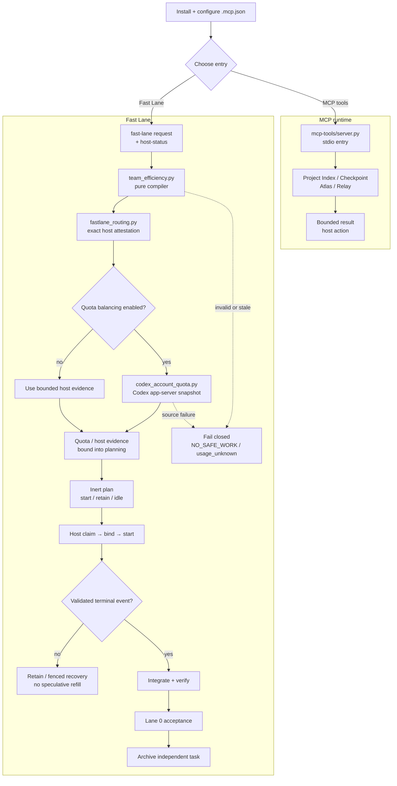

[简体中文](README.zh-CN.md)

# 2718lab DevKit — MCP-only v1.0.0-rc1

2718lab DevKit is a local, stdio-only MCP server for bounded project indexing,
Atlas evidence, Relay lifecycle coordination, and deterministic Fast Lane
planning. This repository contains the v1.0.0-rc1 release candidate. The
checked-in manifest and allowlist define the public package surface; the install,
build, and verification sections below describe the supported workflow.

> [!IMPORTANT]
> **Workflow reminder:** route from bounded evidence, keep one writer per
> write scope, claim and bind before execution, refill only after a validated
> terminal event, integrate and accept before archiving. Prewarm is read-only;
> `action="retain"` is not a new spawn. Keep task scratch, caches, worktrees,
> and evidence in an isolated user-owned workspace; configure quota sample
> storage explicitly when needed. Do not commit runtime state or credentials.

## What is shipped

- Project Index exposes opaque workspace registration, bounded snapshots,
  status, and graph queries.
- Checkpoint services create, inspect, and restore evidence-bound snapshots.
- Atlas provides bounded graph queries, packet preparation, inert rendering,
  and durable acceptance projection.
- Relay validates explicit work packages and exposes lifecycle state. Python
  returns structured host actions; the Codex host remains responsible for
  worktree bootstrap and agent dispatch.
- The primary package is MCP-only: it exposes exactly 16 tools, no MCP prompts,
  no MCP resources, no static prompt agents, and no model runner.
- Fast Lane remains a pure local compiler in the work-methodology skill. It
  selects explicit model/effort routes from bounded difficulty and host
  capability evidence; it never spawns agents, edits Git, or runs commands.

## Module overview

| Module | Responsibility | Start here |
| --- | --- | --- |
| [`mcp-tools/server.py`](mcp-tools/server.py) | stdio MCP entry point and the public 16-tool surface | [MCP surface](#exact-mcp-surface) |
| [`mcp-tools/project_index/`](mcp-tools/project_index/) | workspace registration, bounded snapshots, status, and graph queries | [Project Index tools](#exact-mcp-surface) |
| [`mcp-tools/devkit_atlas/`](mcp-tools/devkit_atlas/) | evidence graph queries, implementation packets, rendering, and acceptance projection | [Atlas tools](#exact-mcp-surface) |
| [`mcp-tools/devkit_relay/`](mcp-tools/devkit_relay/) | explicit work-package compilation and lifecycle host actions | [Relay tools](#exact-mcp-surface) |
| [`mcp-tools/devkit_runtime/`](mcp-tools/devkit_runtime/) | runtime paths, checkpoints, durable boundaries, and the private host bridge | [runtime and recovery](#runtime-data-and-recovery) |
| [`mcp-tools/orchestrator/`](mcp-tools/orchestrator/) | durable workflow, task, lease, and lifecycle state | [workflow lifecycle](skills/work-methodology/references/efficiency-automation.md#workflow-lifecycle-plan) |
| [`skills/work-methodology/`](skills/work-methodology/) | deterministic routing/Fast Lane compiler, quota snapshot collection, contracts, and tests | [Fast Lane contract](skills/work-methodology/SKILL.md) |
| [`.codex-plugin/`](.codex-plugin/) | plugin manifest, artifact allowlist, and reproducible package builder | [artifact build](#build-the-primary-artifact) |

## Overall workflow

The short path is: configure the host, choose the MCP or Fast Lane entry,
let the host execute only bounded actions, and close the lifecycle with
terminal evidence, integration, acceptance, and archive.

## Documentation map

Use this page as the entry point, then follow the contract links instead of
re-reading the whole repository:

- [Work methodology and Fast Lane contract](skills/work-methodology/SKILL.md)
- [Efficiency automation reference and CLI details](skills/work-methodology/references/efficiency-automation.md)
- [Verification checklist](skills/work-methodology/references/verification-checklist.md)
- [Work-package and task-card rules](skills/work-methodology/references/work-packages.md)
- [Orchestration runtime contract](skills/work-methodology/references/orchestration-runtime.md)
- [Team and lane patterns](skills/work-methodology/references/team-patterns.md)
- [Ultra Fast Lane design](docs/superpowers/specs/2026-07-30-ultra-fast-lane-design.md)
- [Codex-first tool/plugin design](docs/superpowers/specs/2026-07-31-codex-first-tool-plugin-design.md)
- [Release history](CHANGELOG.md)

For implementation entry points, see
[the Fast Lane compiler](skills/work-methodology/scripts/team_efficiency.py) and
[the live Codex quota producer](skills/work-methodology/scripts/codex_account_quota.py).

## Exact MCP surface

The public server name is 2718lab-devkit. Every result uses the bounded
2718lab-devkit/tool-result-v1 envelope. The public surface is exactly:

| Area | Tools |
| --- | --- |
| Project Index | project_index_register, project_index_sync, project_index_status, project_index_query |
| Checkpoints | worktree_checkpoint_create, worktree_checkpoint_status, worktree_checkpoint_restore |
| Atlas | atlas_query, atlas_prepare, atlas_render, atlas_accept |
| Relay | relay_compile, relay_start, relay_status, relay_handoff, relay_integrate |

The server has no prompt or resource surface. Tool inputs are structured and
bounded; absolute worker paths, shell fragments, raw source, credentials,
unbounded command output, and caller-forged acceptance evidence are rejected.

## Install and run locally

Requirements: Python 3.11 or newer and uv.

From the repository root:

    cd mcp-tools
    uv sync --locked --no-dev
    uv run --locked --no-dev python server.py

The canonical host configuration is .mcp.json. It runs the locked command
above with mcp-tools as the working directory. The configuration forwards only
the host bridge selector names:

- CODEX_DEVKIT_HOST_BRIDGE_FD
- CODEX_DEVKIT_HOST_BRIDGE_HANDLE

These names are selectors, not values to invent or copy into a task message.
Relay lifecycle mutations that need the private host capability broker or proof
registry fail closed when the host does not provide an attested capability,
using RELAY_CAPABILITY_BROKER_UNAVAILABLE. The server never exposes raw
handles or falls back to an unrelated local start.

## Build the primary artifact

The allowlisted builder creates a deterministic ZIP outside the plugin source
tree. Choose an output directory outside the source tree:

    python .codex-plugin/build_main_artifact.py --plugin-root . --output <artifact-output-dir>/2718lab-devkit-v1.0.0-rc1.zip

The artifact contains the manifest, .mcp.json, LICENSE, the locked Python
project, and the six runtime trees selected by
.codex-plugin/main-artifact-allowlist.json. It does not package skills,
prompts, static agents, host-private state, or arbitrary repository files.
Keep build output and temporary evidence outside the source tree and out of
version control.

## Runtime data and recovery

Persistent data is local. RuntimeConfig resolves the data root in this order:

1. PLUGIN_DATA, when the host explicitly provides an absolute directory.
2. CODEX_HOME/data/2718lab-devkit.
3. The default Codex data directory:
   %USERPROFILE%\.codex\data\2718lab-devkit.

Scratch paths use CODEX_TASK_TEMP, TMPDIR, TEMP, or TMP when explicitly
provided, otherwise a sibling .2718lab-devkit-scratch directory. The runtime
rejects unsafe, overlapping, missing, or reparse-point roots and does not write
fallback state into the repository.

After a host interruption, resume from the durable workflow lease, endpoint,
artifact references, snapshots, and bounded receipts. Rebind a valid current
context before continuing. Do not reconstruct authority from chat history,
raw logs, or an unrelated new start. Archive a completed independent task only
after evidence, commit, integration, and acceptance have all succeeded.

## Deterministic Fast Lane

The Fast Lane compiler is in
skills/work-methodology/scripts/fastlane_routing.py and
skills/work-methodology/scripts/team_efficiency.py.

- Ultra activates the compiler; lower efforts require the host's explicit
  enablement.
- Difficulty, risk, scope, verification cost, blocker severity, and available
  capacity select the route. The requested model and reasoning effort remain
  explicit and host-attested.
- Three physical worker slots are partitioned into start/retain and honest
  idle records. Prewarm is read-only evidence work.
- A free slot is refilled only after a validated terminal event. Commentary
  updates never trigger polling or speculative refill.
- Sol is reserved for the coordinator's design, integration, risk decisions,
  and final acceptance when the checked-in host profile requires it. Terra
  handles normal and complex bounded execution; Luna is used only for an
  exactly attested model/effort pair. No route silently substitutes a model.
- Spark is a narrow severe-blocker lane. It requires a reproducible critical
  path blocker, a bounded decoupling change, a clear stop condition, and
  explicit entitlement; it is not a routine default.

### Live account quota reminder

The host must opt into the official local Codex account source when quota
balancing is part of a dispatch. `--live-quota` reads the main and Spark pools
through `codex app-server --stdio`, binds the fresh signed snapshot to the
quota request, and fails closed to `usage_unknown` on source, freshness, or
signature errors:

    python skills/work-methodology/scripts/team_efficiency.py fast-lane --input <fast-lane-request.json> --host-status <fast-lane-host-status.json> --quota-input <quota-request.json> --live-quota --reasoning-effort ultra

The detailed producer contract is in
[codex_account_quota.py](skills/work-methodology/scripts/codex_account_quota.py).
It never reads `auth.json`, cookies, or private HTTP endpoints; its sample
cache path is user-configurable through `--quota-state-path` (for example, a
project cache on another configured drive). If no path is supplied, it follows
`CODEX_TASK_TEMP`; it never silently falls back to an unapproved temporary
directory.

## Safety and scope boundaries

- Atlas is deterministic and local. It cannot currently connect to third-party
  sources; it does not call an LLM, vector store, network service, shell, or
  patch applier.
- Relay compiles explicit packages and returns host actions; it does not
  fabricate successful spawns. The host owns the actual Codex dispatch.
- Worktree, branch, lease, task, snapshot, receipt, and evidence identities
  are bound and fail closed on stale, forged, cross-workflow, or conflicting
  input.
- stdio stdout is protocol-only. Diagnostics go to stderr.
- Runtime data, task scratch, worktrees, caches, and verification evidence
  remain local and bounded.

## Verification

The RC1 integration was verified with:

    cd mcp-tools
    uv run --locked pytest -q
    uv lock --check
    uv run --locked ruff check devkit_atlas/service.py devkit_runtime/atlas_acceptance.py orchestrator/service.py project_index/checkpoints.py project_index/service.py project_index/store.py
    uv run --locked python -m compileall -q devkit_atlas devkit_runtime orchestrator project_index

The full regression result for the integrated tree was 1037 passed, 13
skipped, and 40 subtests passed. The fresh-artifact stdio checks also verify
the exact 16-tool inventory, empty prompt/resource lists, protocol-clean
stdout, normal and rejected calls, missing-host capability failure, and
source-checkout independence.

## Release status

This repository corresponds to the v1.0.0-rc1 release candidate. Release notes
are in [CHANGELOG.md](CHANGELOG.md); build and install from the checked-in
manifest, artifact allowlist, and locked dependency set.

## License

[AGPL-3.0](LICENSE).
