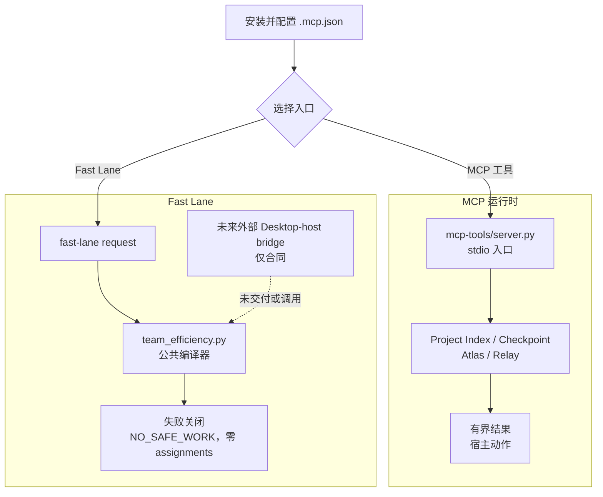

[English](README.md)

# 2718lab DevKit —— MCP-only v1.0.0

2718lab DevKit 是一个本地、仅 stdio 传输的 MCP 服务器，提供有边界的
项目索引、Atlas 证据、Relay 生命周期协调和确定性的 Fast Lane 规划。
本仓库承载版本化的 v1.0.0 包；已提交的 manifest 和 allowlist 定义
公开产物范围，下面的安装、构建和验证章节给出支持的工作流。

当前版本保留刻意 fail-closed 的 Fast Lane 预览。公共编译器和 CLI 固定返回
`NO_SAFE_WORK` 与零 assignments：不会消费 host-status、quota 或实时账号输入，
也没有 worktree 执行路径。Ultra、实时额度和宿主消费属于未来外部
Desktop-host bridge 合同的要求；本仓库并未提供该 bridge。

> [!IMPORTANT]
> **工作流提醒：** 先用有界证据路由；一个写入范围只允许一个 writer；执行前必须
> claim 并 bind；只有验证过的终态事件才能 refill；完成集成和验收后才能归档。
> prewarm 只读，`action="retain"` 不是新 spawn。任务临时目录、缓存、工作树和证据
> 应放在隔离的用户自有工作区。解析兼容的 Fast Lane quota 输入目前不消费额度。
> 不要把运行时状态或凭据提交到仓库。

## 已交付内容

- Project Index 提供不透明工作区注册、受限快照、状态和图查询。
- Checkpoint 服务创建、检查和恢复证据绑定的快照。
- Atlas 提供有边界的图查询、实现包准备、惰性渲染和持久化验收投影。
- Relay 验证显式工作包并暴露生命周期状态。Python 只返回结构化宿主
  动作；工作树准备和 agent 调度仍由 Codex 宿主负责。
- 主包是 MCP-only：精确暴露 17 个工具，不暴露 MCP prompts、MCP
  resources、静态 prompt agent 或模型运行器。
- Fast Lane 是 MCP runtime 中的纯本地编译器。其公共面当前没有调度权限并且
  fail-closed：不会产生 assignment，也不会 spawn agent、修改 Git、运行命令或
  执行 worktree。宿主/私有 quota 消费预留给未来的外部 Desktop-host bridge 合同。

## 核心模块速览

| 模块 | 作用 | 从哪里开始 |
| --- | --- | --- |
| [`mcp-tools/server.py`](mcp-tools/server.py) | stdio MCP 入口和公共 17 工具面 | [精确 MCP 面](#精确-mcp-面) |
| [`mcp-tools/project_index/`](mcp-tools/project_index/) | 工作区注册、受限快照、状态和图查询 | [Project Index 工具](#精确-mcp-面) |
| [`mcp-tools/devkit_atlas/`](mcp-tools/devkit_atlas/) | 证据图查询、实现包、渲染和验收投影 | [Atlas 工具](#精确-mcp-面) |
| [`mcp-tools/devkit_relay/`](mcp-tools/devkit_relay/) | 显式工作包编译和生命周期宿主动作 | [Relay 工具](#精确-mcp-面) |
| [`mcp-tools/devkit_runtime/`](mcp-tools/devkit_runtime/) | 运行时路径、checkpoint、持久边界和宿主私有 bridge | [运行时数据与恢复](#运行时数据与崩溃恢复) |
| [`mcp-tools/orchestrator/`](mcp-tools/orchestrator/) | 持久化 workflow、task、lease 和生命周期状态 | [workflow 生命周期](mcp-tools/devkit_fastlane/references/efficiency-automation.md#workflow-lifecycle-plan) |
| [`mcp-tools/devkit_fastlane/`](mcp-tools/devkit_fastlane/) | 确定性路由/Fast Lane 编译器、未来额度 bridge 参考、契约和测试 | [Fast Lane 契约](mcp-tools/devkit_fastlane/FASTLANE_CONTRACT.md) |
| [`.codex-plugin/`](.codex-plugin/) | 插件 manifest、产物 allowlist 和可复现构建器 | [构建主产物](#构建主产物) |

## 整体工作流

仓库级默认工作流是 Fast Lane。`workflow-design` 准备有界输入；
`fastlane_compile` 或 `team_efficiency.py` 随后只返回无权限、fail-closed 的计划。
`fast-lane-routing` 记录的是预期的未来宿主消费边界；skill 和当前编译器均不会
启动 agent，也不会创建或执行跨会话工作树。当前路径只用于检查被阻断的计划，
权限仍保留在本仓库之外。

## Codex 说明书导航

本地插件包含可选的、仅供查阅的 Codex 说明书 bundle：一个短总览
（`skills/devkit-overview`）、一个工作流设计说明书
（`skills/workflow-design`，默认 Fast Lane 策略）和七份独立模块说明书。按需加载：

`fast-lane-routing` · `astrbot-plugin-dev` · `bugkiller` · `code-atlas` ·
`mcp-server-dev` · `oss-repo-ops` · `python-engineering`。

Skills 是说明书，不是 MCP 工具或可执行的 prompt surface。它们不含 slash command、
agent profile、脚手架模板、校验器或调度代码，并且刻意不进入 MCP-only 主 ZIP。

## 文档导航

把本页作为入口，按契约跳转到需要的细节，不必重复阅读整个仓库：

- [Fast Lane 契约](mcp-tools/devkit_fastlane/FASTLANE_CONTRACT.md)
- [效率自动化参考与 CLI 细节](mcp-tools/devkit_fastlane/references/efficiency-automation.md)
- [验证清单](mcp-tools/devkit_fastlane/references/verification-checklist.md)
- [工作包与任务卡规则](mcp-tools/devkit_fastlane/references/work-packages.md)
- [编排运行时契约](mcp-tools/devkit_fastlane/references/orchestration-runtime.md)
- [团队与 lane 模式](mcp-tools/devkit_fastlane/references/team-patterns.md)
- [历史设计记录](docs/superpowers/README.md)：仅供追溯，可能提及已退出的组件，
  不是当前实现契约。
- [发布历史](CHANGELOG.md)

实现入口见
[Fast Lane 编译器](mcp-tools/devkit_fastlane/scripts/team_efficiency.py)。
额度采集模块仅保留为未来外部 Desktop-host bridge 合同的参考模块；公共编译器和
CLI 不会调用它。

## 精确 MCP 面

公共服务器名为 2718lab-devkit。每个结果都使用有界的
2718lab-devkit/tool-result-v1 包络。公共面精确包含：

| 区域 | 工具 |
| --- | --- |
| Project Index | project_index_register、project_index_sync、project_index_status、project_index_query |
| Checkpoint | worktree_checkpoint_create、worktree_checkpoint_status、worktree_checkpoint_restore |
| Atlas | atlas_query、atlas_prepare、atlas_render、atlas_accept |
| Relay | relay_compile、relay_start、relay_status、relay_handoff、relay_integrate |
| Fast Lane | fastlane_compile |

服务器没有 prompt 或 resource 面。工具输入是结构化且有界的；绝对工作
者路径、Shell 片段、原始源码、凭据、无界命令输出和调用方伪造的验收证据
都会被拒绝。

## 本地安装与运行

要求：Python 3.11 或更高版本，以及 uv。

在仓库根目录执行：

    cd mcp-tools
    uv sync --locked --no-dev
    uv run --locked --no-dev python server.py

标准宿主配置是 .mcp.json。它以 mcp-tools 为工作目录运行上面的锁定命令，
转发两个宿主私有 bridge selector 名称，以及可选的项目/线程范围标识：

- CODEX_DEVKIT_HOST_BRIDGE_FD
- CODEX_DEVKIT_HOST_BRIDGE_HANDLE
- CODEX_PROJECT_ROOT、CODEX_WORKSPACE_ROOT
- CODEX_PROJECT_ID、CODEX_WORKSPACE_ID、CODEX_THREAD_ID

这些是 selector 或 identity 名称，不是应该自行编造或塞进任务消息的值。后五项
会把持久化状态限定在单个项目或线程，避免投影到另一个工作区。需要私有
宿主 capability broker 或 proof registry 的 Relay 生命周期变更，在宿主
没有提供可证明能力时会失败关闭，并返回
RELAY_CAPABILITY_BROKER_UNAVAILABLE。服务器不会暴露原始 handle，也不会
退回到无关的本地 start。

## 构建主产物

allowlist builder 会在插件源码树之外生成确定性的 ZIP。请选择源码树之外的输出目录：

    python .codex-plugin/build_main_artifact.py --plugin-root . --output <artifact-output-dir>/2718lab-devkit-v1.0.0.zip

产物包含 manifest、.mcp.json、LICENSE、锁定的 Python 项目，以及
.codex-plugin/main-artifact-allowlist.json 选中的运行时文件。它的公共运行面
仍是 MCP-only；ZIP 同时携带 Fast Lane 契约、必需参考资料和策略 assets、
`team_efficiency.py` 兼容入口、其路由与额度平衡模块，以及宿主专用官方账号
额度采集模块。它明确不包含可选 skill bundle、命令辅助文件、hooks、CI 文件、
宿主私有状态、prompts、静态 agent 或任意仓库文件。

Fast Lane 可通过以下可执行入口检查其 fail-closed 结果：

    python mcp-tools/devkit_fastlane/scripts/team_efficiency.py fast-lane --input <fast-lane-request.json> --reasoning-effort ultra

遗留的 `--host-status`、quota 和 live-quota 开关仅保持解析兼容。当前公共 CLI
不会读取或消费它们，不会采集额度样本，也不能激活工作。实时额度和 quota cache
属于未来外部 Desktop-host bridge 合同，不属于本发行版。

`CODEX_FASTLANE_TASK_ROOT` 以及 worktree/cache 位置同样预留给未来由宿主拥有的
执行 bridge。当前公共编译器既不会创建也不会执行 worktree，不能把它的输出当作
已接受 worktree 配置的证据。

## 运行时数据与崩溃恢复

持久化数据留在本地。RuntimeConfig 按以下顺序解析数据根：

1. 宿主显式提供的绝对目录 PLUGIN_DATA。
2. CODEX_HOME/data/2718lab-devkit。
3. 默认 Codex 数据目录：
   %USERPROFILE%\.codex\data\2718lab-devkit。

当宿主提供 CODEX_PROJECT_ROOT 或 CODEX_WORKSPACE_ROOT 时，持久化根会在
`scoped-v1` 下按该项目根的 SHA-256 身份继续分域。没有项目根时，
CODEX_PROJECT_ID、CODEX_WORKSPACE_ID 或 CODEX_THREAD_ID 会提供非路径的
回退范围。原始项目路径或 identity 不会写入范围目录名。这能避免长生命周期
插件进程把一个项目的 workflow、index 或 receipt 投影到另一个项目。没有范围
的命令行调用为了兼容性仍使用未加后缀的根；宿主集成应始终提供项目或线程范围。

临时目录依次使用显式提供的 CODEX_TASK_TEMP、TMPDIR、TEMP 或 TMP；都未
提供时，使用 data 根旁的 .2718lab-devkit-scratch。已配置的临时根也会获得
与持久化数据相同的范围后缀。运行时会拒绝不安全、重叠、缺失或 reparse-point
根目录，不会把回退状态写入仓库。

宿主中断后，应从持久化工作流租约、端点、artifact 引用、快照和有界
receipt 恢复。继续前先重新绑定有效的当前上下文。不得从聊天记录、原始
日志或无关的新 start 重建权限。独立任务只有在证据、提交、集成和验收
全部完成后才可归档。

## 确定性 Fast Lane

Fast Lane 编译器位于
mcp-tools/devkit_fastlane/scripts/fastlane_routing.py 和
mcp-tools/devkit_fastlane/scripts/team_efficiency.py。公共 MCP 入口为
`fastlane_compile`；当前每一次调用都会刻意以 `NO_SAFE_WORK` 和零 assignments
被阻断。

- `ultra` 和 `--enable` 只选择被阻断结果的形状，不会激活调度。
- 公共编译器/CLI 不消费 host-status、quota request、实时额度、index evidence 或
  worktree root。
- 它不会派发会话、创建 worktree、补位或运行命令；仓库内不存在这些动作的执行路径。
- 外部 Desktop-host bridge 未来可以提供经证明的项目权限、宿主/额度消费和执行能力。
  这只是未来合同，不是已交付实现，也不是任何 Desktop host 源码已经存在的声明。

### 实时账号额度边界

实时账号额度不是当前公共 Fast Lane 能力。向本发行版传入 `--live-quota`、
`--quota-input` 或 `--quota-state-path` 不会读取账号来源、消费额度证据，也不会改变
零 assignment 的结果。现有
[codex_account_quota.py](mcp-tools/devkit_fastlane/scripts/codex_account_quota.py)
是未来外部 Desktop-host bridge 合同的参考材料；本仓库不提供也不会调用该 bridge。

## 安全与范围边界

- Atlas 是本地确定性服务，暂时无法接入第三方源；不调用 LLM、向量库、网络
  服务、Shell 或补丁应用器。
- Relay 编译显式工作包并返回宿主动作，不伪造成功 spawn；真正的 Codex
  调度由宿主负责。
- 工作树、分支、租约、任务、快照、receipt 和证据身份均有绑定；过期、
  伪造、跨工作流或冲突输入会失败关闭。
- stdio stdout 只承载协议；诊断写入 stderr。
- 运行时数据、任务临时目录、工作树、缓存和验证证据均保持本地且有界。

## 验证

请从将要构建的 revision 运行以下发布验证：

    cd mcp-tools
    uv run --locked pytest -q
    uv lock --check
    uv run --locked ruff check devkit_atlas/service.py devkit_runtime/atlas_acceptance.py orchestrator/service.py project_index/checkpoints.py project_index/service.py project_index/store.py
    uv run --locked python -m compileall -q devkit_atlas devkit_runtime orchestrator project_index

CI 和全新产物检查才是当前测试计数的唯一来源。它们验证精确 17 工具清单、
空 prompt/resource 列表、协议干净的 stdout、正常和拒绝调用、缺失宿主能力时的
失败关闭，以及不依赖源 checkout 的独立启动。本 README 刻意不冻结会过期的回归计数。

## 版本

本仓库代表版本化的 v1.0.0 包。发布说明见
[CHANGELOG.md](CHANGELOG.md)；构建和安装请以已提交的 manifest、产物 allowlist
和锁定依赖为准。由维护者在 main 上触发的发布工作流只会在声明的 gates 通过后发布匹配的
GitHub Release。

## 许可证

[AGPL-3.0](LICENSE)。
