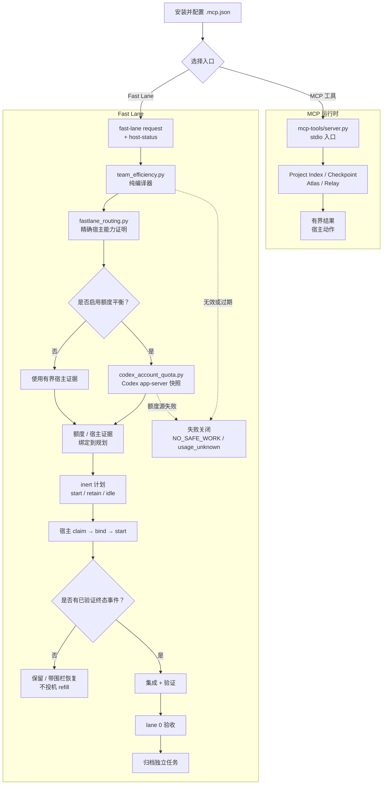

[English](README.md)

# 2718lab DevKit —— MCP-only v1.0.0-rc1

2718lab DevKit 是一个本地、仅 stdio 传输的 MCP 服务器，提供有边界的
项目索引、Atlas 证据、Relay 生命周期协调和确定性的 Fast Lane 规划。
本仓库对应 v1.0.0-rc1 发布候选版；已提交的 manifest 和 allowlist 定义
公开产物范围，下面的安装、构建和验证章节给出支持的工作流。

> [!IMPORTANT]
> **工作流提醒：** 先用有界证据路由；一个写入范围只允许一个 writer；执行前必须
> claim 并 bind；只有验证过的终态事件才能 refill；完成集成和验收后才能归档。
> prewarm 只读，`action="retain"` 不是新 spawn。任务临时目录、缓存、工作树和证据
> 应放在隔离的用户自有工作区；需要时显式配置 quota 样本缓存路径。不要把运行时
> 状态或凭据提交到仓库。

## 已交付内容

- Project Index 提供不透明工作区注册、受限快照、状态和图查询。
- Checkpoint 服务创建、检查和恢复证据绑定的快照。
- Atlas 提供有边界的图查询、实现包准备、惰性渲染和持久化验收投影。
- Relay 验证显式工作包并暴露生命周期状态。Python 只返回结构化宿主
  动作；工作树准备和 agent 调度仍由 Codex 宿主负责。
- 主包是 MCP-only：精确暴露 16 个工具，不暴露 MCP prompts、MCP
  resources、静态 prompt agent 或模型运行器。
- Fast Lane 仍是 work-methodology skill 中的纯本地编译器。它根据有界
  难度和宿主能力证据选择显式模型/推理级别，不创建 agent、不改 Git、
  不执行命令。

## 核心模块速览

| 模块 | 作用 | 从哪里开始 |
| --- | --- | --- |
| [`mcp-tools/server.py`](mcp-tools/server.py) | stdio MCP 入口和公共 16 工具面 | [精确 MCP 面](#精确-mcp-面) |
| [`mcp-tools/project_index/`](mcp-tools/project_index/) | 工作区注册、受限快照、状态和图查询 | [Project Index 工具](#精确-mcp-面) |
| [`mcp-tools/devkit_atlas/`](mcp-tools/devkit_atlas/) | 证据图查询、实现包、渲染和验收投影 | [Atlas 工具](#精确-mcp-面) |
| [`mcp-tools/devkit_relay/`](mcp-tools/devkit_relay/) | 显式工作包编译和生命周期宿主动作 | [Relay 工具](#精确-mcp-面) |
| [`mcp-tools/devkit_runtime/`](mcp-tools/devkit_runtime/) | 运行时路径、checkpoint、持久边界和宿主私有 bridge | [运行时数据与恢复](#运行时数据与崩溃恢复) |
| [`mcp-tools/orchestrator/`](mcp-tools/orchestrator/) | 持久化 workflow、task、lease 和生命周期状态 | [workflow 生命周期](skills/work-methodology/references/efficiency-automation.md#workflow-lifecycle-plan) |
| [`skills/work-methodology/`](skills/work-methodology/) | 确定性路由/Fast Lane 编译器、额度快照采集、契约和测试 | [Fast Lane 契约](skills/work-methodology/SKILL.md) |
| [`.codex-plugin/`](.codex-plugin/) | 插件 manifest、产物 allowlist 和可复现构建器 | [构建主产物](#构建主产物) |

## 整体工作流

最短路径是：配置宿主，选择 MCP 或 Fast Lane 入口，只让宿主执行有界动作，
再用终态证据完成集成、验收和归档。

## 文档导航

把本页作为入口，按契约跳转到需要的细节，不必重复阅读整个仓库：

- [工作方法与 Fast Lane 契约](skills/work-methodology/SKILL.md)
- [效率自动化参考与 CLI 细节](skills/work-methodology/references/efficiency-automation.md)
- [验证清单](skills/work-methodology/references/verification-checklist.md)
- [工作包与任务卡规则](skills/work-methodology/references/work-packages.md)
- [编排运行时契约](skills/work-methodology/references/orchestration-runtime.md)
- [团队与 lane 模式](skills/work-methodology/references/team-patterns.md)
- [Ultra Fast Lane 设计](docs/superpowers/specs/2026-07-30-ultra-fast-lane-design.md)
- [Codex-first 工具/插件设计](docs/superpowers/specs/2026-07-31-codex-first-tool-plugin-design.md)
- [发布历史](CHANGELOG.md)

实现入口见
[Fast Lane 编译器](skills/work-methodology/scripts/team_efficiency.py) 和
[实时 Codex 额度采集与快照模块](skills/work-methodology/scripts/codex_account_quota.py)。

## 精确 MCP 面

公共服务器名为 2718lab-devkit。每个结果都使用有界的
2718lab-devkit/tool-result-v1 包络。公共面精确包含：

| 区域 | 工具 |
| --- | --- |
| Project Index | project_index_register、project_index_sync、project_index_status、project_index_query |
| Checkpoint | worktree_checkpoint_create、worktree_checkpoint_status、worktree_checkpoint_restore |
| Atlas | atlas_query、atlas_prepare、atlas_render、atlas_accept |
| Relay | relay_compile、relay_start、relay_status、relay_handoff、relay_integrate |

服务器没有 prompt 或 resource 面。工具输入是结构化且有界的；绝对工作
者路径、Shell 片段、原始源码、凭据、无界命令输出和调用方伪造的验收证据
都会被拒绝。

## 本地安装与运行

要求：Python 3.11 或更高版本，以及 uv。

在仓库根目录执行：

    cd mcp-tools
    uv sync --locked --no-dev
    uv run --locked --no-dev python server.py

标准宿主配置是 .mcp.json。它以 mcp-tools 为工作目录运行上面的锁定命令，
只转发以下宿主 bridge selector 名称：

- CODEX_DEVKIT_HOST_BRIDGE_FD
- CODEX_DEVKIT_HOST_BRIDGE_HANDLE

这些是 selector 名称，不是应该自行编造或塞进任务消息的值。需要私有
宿主 capability broker 或 proof registry 的 Relay 生命周期变更，在宿主
没有提供可证明能力时会失败关闭，并返回
RELAY_CAPABILITY_BROKER_UNAVAILABLE。服务器不会暴露原始 handle，也不会
退回到无关的本地 start。

## 构建主产物

allowlist builder 会在插件源码树之外生成确定性的 ZIP。请选择源码树之外的输出目录：

    python .codex-plugin/build_main_artifact.py --plugin-root . --output <artifact-output-dir>/2718lab-devkit-v1.0.0-rc1.zip

产物包含 manifest、.mcp.json、LICENSE、锁定的 Python 项目，以及
.codex-plugin/main-artifact-allowlist.json 选中的六棵运行时目录树。它
不会打包 skills、prompts、静态 agent、宿主私有状态或任意仓库文件。
构建输出和临时证据应放在源码树之外，并排除在版本控制之外。

## 运行时数据与崩溃恢复

持久化数据留在本地。RuntimeConfig 按以下顺序解析数据根：

1. 宿主显式提供的绝对目录 PLUGIN_DATA。
2. CODEX_HOME/data/2718lab-devkit。
3. 默认 Codex 数据目录：
   %USERPROFILE%\.codex\data\2718lab-devkit。

临时目录依次使用显式提供的 CODEX_TASK_TEMP、TMPDIR、TEMP 或 TMP；都未
提供时，使用 data 根旁的 .2718lab-devkit-scratch。运行时会拒绝不安全、
重叠、缺失或 reparse-point 根目录，不会把回退状态写入仓库。

宿主中断后，应从持久化工作流租约、端点、artifact 引用、快照和有界
receipt 恢复。继续前先重新绑定有效的当前上下文。不得从聊天记录、原始
日志或无关的新 start 重建权限。独立任务只有在证据、提交、集成和验收
全部完成后才可归档。

## 确定性 Fast Lane

Fast Lane 编译器位于
skills/work-methodology/scripts/fastlane_routing.py 和
skills/work-methodology/scripts/team_efficiency.py。

- Ultra 会激活编译器；低于 Ultra 的 effort 需要宿主显式启用。
- 难度、风险、范围、验证成本、阻塞严重度和可用容量共同选择路由。
  请求的模型与推理级别保持显式，并且必须有宿主证明。
- 三个物理 worker 槽位被划分为 start/retain 和诚实的 idle 记录。
  prewarm 始终是只读证据工作。
- 只有验证过的终态事件才能释放并补位。commentary 更新不会触发轮询
  或投机性 refill。
- 当仓库内宿主 profile 要求时，Sol 负责协调器设计、集成、风险决策和
  最终验收；Terra 处理常规及复杂的有界执行；Luna 只有在精确模型/
  effort 组合被证明时才可使用。路由不会静默替换模型。
- Spark 是严重阻塞的窄道。它需要可复现的关键路径阻塞、有界解耦改动、
  明确停止条件和显式 entitlement，不是日常默认路线。

### 实时账号额度提醒

需要额度平衡时，宿主必须显式接入官方本地 Codex 额度源。`--live-quota` 通过
`codex app-server --stdio` 读取主池和 Spark 池，把新鲜签名快照绑定到 quota request；
来源、freshness 或签名异常时会失败关闭为 `usage_unknown`：

    python skills/work-methodology/scripts/team_efficiency.py fast-lane --input <fast-lane-request.json> --host-status <fast-lane-host-status.json> --quota-input <quota-request.json> --live-quota --reasoning-effort ultra

详细的额度采集与快照契约见
[codex_account_quota.py](skills/work-methodology/scripts/codex_account_quota.py)。它不会读取
`auth.json`、cookie 或私有 HTTP 接口；样本缓存路径由用户通过
`--quota-state-path` 配置（例如其他已配置盘符上的项目缓存）。未提供时跟随
`CODEX_TASK_TEMP`，不会静默回落到未批准的临时目录。

## 安全与范围边界

- Atlas 是本地确定性服务，暂时无法接入第三方源；不调用 LLM、向量库、网络
  服务、Shell 或补丁应用器。
- Relay 编译显式工作包并返回宿主动作，不伪造成功 spawn；真正的 Codex
  调度由宿主负责。
- 工作树、分支、租约、任务、快照、receipt 和证据身份均有绑定；过期、
  伪造、跨工作流或冲突输入会失败关闭。
- stdio stdout 只承载协议；诊断写入 stderr。
- 运行时数据、任务临时目录、工作树、缓存和验证证据均保持本地且有界。

## 验证

RC1 集成树已按以下命令完成验证：

    cd mcp-tools
    uv run --locked pytest -q
    uv lock --check
    uv run --locked ruff check devkit_atlas/service.py devkit_runtime/atlas_acceptance.py orchestrator/service.py project_index/checkpoints.py project_index/service.py project_index/store.py
    uv run --locked python -m compileall -q devkit_atlas devkit_runtime orchestrator project_index

集成树全量回归结果为 1037 passed、13 skipped、40 个 subtests passed。
全新产物 stdio 检查还验证了精确 16 工具清单、空 prompt/resource 列表、
协议干净的 stdout、正常和拒绝调用、缺失宿主能力时的失败关闭，以及不依赖
源 checkout 的独立启动。

## 发布状态

本仓库对应 v1.0.0-rc1 发布候选版。发布说明见
[CHANGELOG.md](CHANGELOG.md)；构建和安装请以已提交的 manifest、产物 allowlist
和锁定依赖为准。

## 许可证

[AGPL-3.0](LICENSE)。
