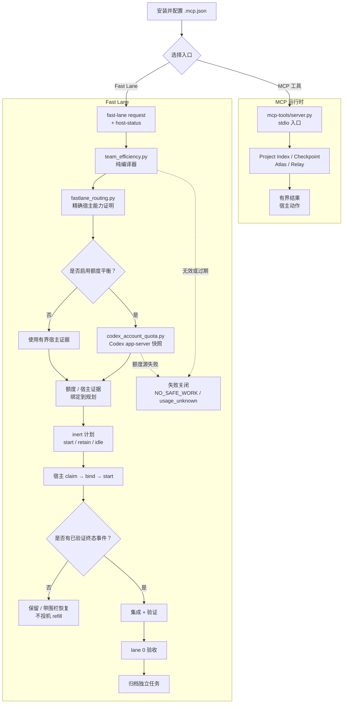

[English](README.md)

# 2718lab DevKit —— Codex + MCP v1.0.0-rc4

[](./.codex-plugin/plugin.json)
[](LICENSE)

2718lab DevKit 是一个 Codex-first 工程工具包：它包含一个本地、仅 stdio
传输的 MCP 运行时，用于有边界的项目索引、Atlas 证据、Relay 生命周期协调和
确定性的 Fast Lane 规划；同时还包含一组精简的 Skill 说明书。本仓库承载版本化的
v1.0.0-rc4 包；已提交的 manifest 和 allowlist 定义可执行运行时范围，说明书导航、
安装、构建和验证章节共同给出支持的工作流。

RC4 保留 fail-closed 的 Host 合同预览，但不会自行创建 Desktop 会话；缺少
Host 私有验证器时，intent admission 一律返回 `NO_SAFE_WORK`。

> [!IMPORTANT]
> **工作流提醒：** 先用有界证据路由；一个写入范围只允许一个 writer；执行前必须
> claim 并 bind；只有验证过的终态事件才能 refill；完成集成和验收后才能归档。
> prewarm 只读，`action="retain"` 不是新 spawn。任务临时目录、缓存、工作树和证据
> 应放在隔离的用户自有工作区；需要时显式配置 quota 样本缓存路径。不要把运行时
> 状态或凭据提交到仓库。

## 已交付内容

- Project Index 提供不透明工作区注册、受限快照、状态和图查询。
- Checkpoint 服务创建、检查和恢复证据绑定的快照。
- Atlas 提供有边界的图查询、实现包准备、惰性渲染和持久化验收投影。
- Relay 验证显式工作包并暴露生命周期状态。Python 只返回结构化宿主
  动作；工作树准备和 agent 调度仍由 Codex 宿主负责。
- 可执行 MCP 运行时精确暴露 17 个工具，不暴露 MCP prompts、MCP resources、
  静态 prompt agent 或模型运行器。
- 可选的 Codex Skill bundle 是 DevKit 的说明书表面，提供简短的模块化手册；
  它不构成第二个运行时，也不是可执行的 prompt/agent 表面。
- Fast Lane 是 MCP runtime 中的纯本地编译器。它根据有界难度和宿主能力
  证据选择显式模型/推理级别，不创建 agent、不改 Git、不执行命令；额度
  和生命周期证明仍是宿主私有输入。

## 核心模块速览

| 模块 | 作用 | 从哪里开始 |
| --- | --- | --- |
| [`mcp-tools/server.py`](mcp-tools/server.py) | stdio MCP 入口和公共 17 工具面 | [精确 MCP 面](#精确-mcp-面) |
| [`mcp-tools/project_index/`](mcp-tools/project_index/) | 工作区注册、受限快照、状态和图查询 | [Project Index 工具](#精确-mcp-面) |
| [`mcp-tools/devkit_atlas/`](mcp-tools/devkit_atlas/) | 证据图查询、实现包、渲染和验收投影 | [Atlas 工具](#精确-mcp-面) |
| [`mcp-tools/devkit_relay/`](mcp-tools/devkit_relay/) | 显式工作包编译和生命周期宿主动作 | [Relay 工具](#精确-mcp-面) |
| [`mcp-tools/devkit_runtime/`](mcp-tools/devkit_runtime/) | 运行时路径、checkpoint、持久边界和宿主私有 bridge | [运行时数据与恢复](#运行时数据与崩溃恢复) |
| [`mcp-tools/orchestrator/`](mcp-tools/orchestrator/) | 持久化 workflow、task、lease 和生命周期状态 | [workflow 生命周期](mcp-tools/devkit_fastlane/references/efficiency-automation.md#workflow-lifecycle-plan) |
| [`mcp-tools/devkit_fastlane/`](mcp-tools/devkit_fastlane/) | 确定性路由/Fast Lane 编译器、额度快照采集、契约和测试 | [Fast Lane 契约](mcp-tools/devkit_fastlane/FASTLANE_CONTRACT.md) |
| [`.codex-plugin/`](.codex-plugin/) | 插件 manifest、产物 allowlist 和可复现构建器 | [构建主产物](#构建主产物) |

## 整体工作流

仓库级默认工作流是 Fast Lane。`workflow-design` 负责准备有界输入，宿主再调用
`fastlane_compile` 或 `team_efficiency.py` 编译 inert 计划。
`fast-lane-routing` 只是宿主消费指南：skill 和编译器本身都不会启动 agent，
也不会创建跨会话工作树。最短路径是：配置宿主，选择 MCP 或 Fast Lane 入口，
编译有界计划，只让有能力的宿主执行带围栏的描述符，
再用终态证据完成集成、验收和归档。



## Codex 说明书导航

DevKit 刻意分为两个表面：MCP 运行时执行有界工具工作，本地插件则包含可选的、
仅供查阅的 Codex 说明书 bundle。该 bundle 有一个短总览
（`skills/devkit-overview`）、一个工作流设计说明书
（`skills/workflow-design`，默认 Fast Lane 策略）和六份独立模块说明书。按需加载：

`fast-lane-routing` · `bugkiller` · `code-atlas` ·
`mcp-server-dev` · `oss-repo-ops` · `python-engineering`。

Skills 是说明书，不是 MCP 工具或可执行的 prompt surface。它们不含 slash command、
agent profile、脚手架模板、校验器或调度代码。精简的运行时 ZIP 刻意不带入这些
说明书，但这个打包边界不代表 DevKit 只包含 MCP 运行时。

## 文档导航

把本页作为入口，按契约跳转到需要的细节，不必重复阅读整个仓库：

- [Fast Lane 契约](mcp-tools/devkit_fastlane/FASTLANE_CONTRACT.md)
- [效率自动化参考与 CLI 细节](mcp-tools/devkit_fastlane/references/efficiency-automation.md)
- [验证清单](mcp-tools/devkit_fastlane/references/verification-checklist.md)
- [工作包与任务卡规则](mcp-tools/devkit_fastlane/references/work-packages.md)
- [编排运行时契约](mcp-tools/devkit_fastlane/references/orchestration-runtime.md)
- [团队与 lane 模式](mcp-tools/devkit_fastlane/references/team-patterns.md)
- [仓库自动化与审查](docs/governance/repository-automation.md)
- [参与贡献](CONTRIBUTING.md) · [安全报告](SECURITY.md) · [行为准则](CODE_OF_CONDUCT.md)
- [历史设计记录](docs/superpowers/README.md)：仅供追溯，可能提及已退出的组件，
  不是当前实现契约。
- [发布历史](CHANGELOG.md)

实现入口见
[Fast Lane 编译器](mcp-tools/devkit_fastlane/scripts/team_efficiency.py) 和
[宿主专用 Codex 额度采集与快照模块](mcp-tools/devkit_fastlane/scripts/codex_account_quota.py)。

## 精确 MCP 面

公共服务器名为 2718lab-devkit。每个结果都使用有界的
2718lab-devkit/tool-result-v1 包络。公共面精确包含：

| 区域 | 工具 |
| --- | --- |
| Project Index | project_index_register、project_index_sync、project_index_status、project_index_query |
| Checkpoint | worktree_checkpoint_create、worktree_checkpoint_status、worktree_checkpoint_restore |
| Atlas | atlas_query、atlas_prepare、atlas_render、atlas_accept |
| Relay | relay_compile、relay_start、relay_status、relay_handoff、relay_integrate |
| Fast Lane | fastlane_compile |

服务器没有 prompt 或 resource 面。工具输入是结构化且有界的；绝对工作
者路径、Shell 片段、原始源码、凭据、无界命令输出和调用方伪造的验收证据
都会被拒绝。

## 本地安装与运行

要求：Python 3.11 或更高版本，以及 uv。

在仓库根目录执行：

    cd mcp-tools
    uv sync --locked --no-dev
    uv run --locked --no-dev python server.py

标准宿主配置是 .mcp.json。它以 mcp-tools 为工作目录运行上面的锁定命令，
转发两个宿主私有 bridge selector 名称，以及可选的项目/线程范围标识：

- CODEX_DEVKIT_HOST_BRIDGE_FD
- CODEX_DEVKIT_HOST_BRIDGE_HANDLE
- CODEX_PROJECT_ROOT、CODEX_WORKSPACE_ROOT
- CODEX_PROJECT_ID、CODEX_WORKSPACE_ID、CODEX_THREAD_ID

这些是 selector 或 identity 名称，不是应该自行编造或塞进任务消息的值。后五项
会把持久化状态限定在单个项目或线程，避免投影到另一个工作区。需要私有
宿主 capability broker 或 proof registry 的 Relay 生命周期变更，在宿主
没有提供可证明能力时会失败关闭，并返回
RELAY_CAPABILITY_BROKER_UNAVAILABLE。服务器不会暴露原始 handle，也不会
退回到无关的本地 start。

## 构建主产物

allowlist builder 会在插件源码树之外生成确定性的 ZIP。请选择源码树之外的输出目录：

    python .codex-plugin/build_main_artifact.py --plugin-root . --output <artifact-output-dir>/2718lab-devkit-v1.0.0-rc4.zip

产物包含 manifest、.mcp.json、LICENSE、锁定的 Python 项目，以及
.codex-plugin/main-artifact-allowlist.json 选中的运行时文件。它的可执行运行时
表面是 MCP 服务器；ZIP 同时携带 Fast Lane 契约、必需参考资料和策略 assets、
`team_efficiency.py` 兼容入口、其路由与额度平衡模块，以及宿主专用官方账号
额度采集模块。它明确不包含可选的 Skill 说明书 bundle、命令辅助文件、hooks、CI
文件、宿主私有状态、prompts、静态 agent 或任意仓库文件。

Fast Lane 应通过以下可执行入口运行：

    python mcp-tools/devkit_fastlane/scripts/team_efficiency.py fast-lane --input <fast-lane-request.json> --host-status <fast-lane-host-status.json> --reasoning-effort ultra

需要实时额度时，补充 `--quota-input`、`--live-quota`，并可选择提供绝对路径的
`--quota-state-path <user-owned-cache-file>`。这个由用户配置的缓存只保存有界的
最近样本；未提供该选项时，会在已设置的 `CODEX_TASK_TEMP` 下使用缓存，否则不
保存样本缓存。构建输出、额度缓存和临时证据都应放在源码树之外，并排除在版本
控制之外。

Fast Lane 的 worktree 与 worker cache 位置由 `CODEX_FASTLANE_TASK_ROOT`
独立配置，MCP manifest 会从宿主转发该变量。未设置时保持
`D:\bun\tmp\codex`；设置时必须是现存、本地绝对、非 C 盘、不得为卷根且无
reparse-point 的目录。编译器只会在其下派生受限的相对 `project`，根变化、越界
目标、project reparse-point、Win32 路径别名或不在声明 project 下的 read worktree
都会 fail-closed；每个 read context 也绑定规范根 hash。默认 bootstrap 输出仍是
v1；非默认根只在 bootstrap-v2 中以同一规范 hash 绑定，绝不接受 request 自报根
路径。这是可信宿主配置，绝不是 request JSON 字段。

例如，先创建目标目录，再在启动 Codex 前设置 G 盘任务根：

```powershell
$env:CODEX_FASTLANE_TASK_ROOT = 'G:\CodexData\fastlane'
```

## 运行时数据与崩溃恢复

持久化数据留在本地。RuntimeConfig 按以下顺序解析数据根：

1. 宿主显式提供的绝对目录 PLUGIN_DATA。
2. CODEX_HOME/data/2718lab-devkit。
3. 默认 Codex 数据目录：
   %USERPROFILE%\.codex\data\2718lab-devkit。

当宿主提供 CODEX_PROJECT_ROOT 或 CODEX_WORKSPACE_ROOT 时，持久化根会在
`scoped-v1` 下按该项目根的 SHA-256 身份继续分域。没有项目根时，
CODEX_PROJECT_ID、CODEX_WORKSPACE_ID 或 CODEX_THREAD_ID 会提供非路径的
回退范围。原始项目路径或 identity 不会写入范围目录名。这能避免长生命周期
插件进程把一个项目的 workflow、index 或 receipt 投影到另一个项目。没有范围
的命令行调用为了兼容性仍使用未加后缀的根；宿主集成应始终提供项目或线程范围。

临时目录依次使用显式提供的 CODEX_TASK_TEMP、TMPDIR、TEMP 或 TMP；都未
提供时，使用 data 根旁的 .2718lab-devkit-scratch。已配置的临时根也会获得
与持久化数据相同的范围后缀。运行时会拒绝不安全、重叠、缺失或 reparse-point
根目录，不会把回退状态写入仓库。

宿主中断后，应从持久化工作流租约、端点、artifact 引用、快照和有界
receipt 恢复。继续前先重新绑定有效的当前上下文。不得从聊天记录、原始
日志或无关的新 start 重建权限。独立任务只有在证据、提交、集成和验收
全部完成后才可归档。

## 确定性 Fast Lane

Fast Lane 编译器位于
mcp-tools/devkit_fastlane/scripts/fastlane_routing.py 和
mcp-tools/devkit_fastlane/scripts/team_efficiency.py。公共 MCP 入口为
`fastlane_compile`，只返回惰性描述符。

- 工作流默认不等于 CLI 隐式启动：宿主必须显式提供 effort。Ultra 会激活
  编译器；低于 Ultra 的 effort 需要宿主显式传入 `--enable`。
- 难度、风险、范围、验证成本、阻塞严重度和可用容量共同选择路由。
  请求的模型与推理级别保持显式，并且必须有宿主证明。
- 每个 assignment 都会渲染给 `collaboration.spawn_agent` 使用的
  `host_dispatch`；宿主必须原样传入其中的 `model` 和 `reasoning_effort`，
  不得继承当前会话模型。assignment 同时携带一个有界 `index_context`：
  宿主只在边界各查询一次，worker 消费 packet，不轮询索引，也不手写索引编排。
- 跨会话选择由 compiler 固定。只有当
  `dispatch_policy.action=dispatch_all` projection 及其 worktree/fence 义务都
  验证通过时，有能力的宿主集成才机械消费所有列出的 assignment；编译器和 skill
  本身不创建会话或工作树。
- 每个 Codex 会话有三个本地 child 槽位，划分为 start/retain 和诚实的 idle
  记录。存在新鲜签名额度快照及经验证的全局 ledger 时，主池可在所有会话间目标化
  6、8、10 或 12 个非 Spark agent 槽位。prewarm 始终是只读证据工作。
- 只有验证过的终态事件才能释放并补位。commentary 更新不会触发轮询
  或投机性 refill。
- 协调器始终保有派发、集成、风险决策和验收责任。只有精确宿主证明的路由要求
  架构、困难诊断或独立终审时才使用 Sol lane；Terra 和 Luna 各自处理被精确证明
  的路线。路由不会静默替换模型。
- Spark 是严重阻塞的窄道。它需要可复现的关键路径阻塞、有界解耦改动、
  明确停止条件和显式 entitlement，不是日常默认路线。

### 实时账号额度提醒

需要额度平衡时，宿主必须显式接入官方本地 Codex 额度源。`--live-quota` 通过
`codex app-server --stdio` 读取主池和 Spark 池，把新鲜签名快照绑定到 quota request；
来源、freshness 或签名异常时会失败关闭为 `usage_unknown`：

    python mcp-tools/devkit_fastlane/scripts/team_efficiency.py fast-lane --input <fast-lane-request.json> --host-status <fast-lane-host-status.json> --quota-input <quota-request.json> --live-quota --reasoning-effort ultra

详细的额度采集与快照契约见
[codex_account_quota.py](mcp-tools/devkit_fastlane/scripts/codex_account_quota.py)。它不会读取
`auth.json`、cookie 或私有 HTTP 接口；样本缓存路径由用户通过
`--quota-state-path` 配置（例如其他已配置盘符上的项目缓存）。未提供时跟随
`CODEX_TASK_TEMP`，不会静默回落到未批准的临时目录。

## 安全与范围边界

- Atlas 是本地确定性服务，暂时无法接入第三方源；不调用 LLM、向量库、网络
  服务、Shell 或补丁应用器。
- Relay 编译显式工作包并返回宿主动作，不伪造成功 spawn；真正的 Codex
  调度由宿主负责。
- 工作树、分支、租约、任务、快照、receipt 和证据身份均有绑定；过期、
  伪造、跨工作流或冲突输入会失败关闭。
- stdio stdout 只承载协议；诊断写入 stderr。
- 运行时数据、任务临时目录、工作树、缓存和验证证据均保持本地且有界。

## 验证

请从将要构建的 revision 运行以下发布验证：

    cd mcp-tools
    uv run --locked pytest -q
    uv lock --check
    uv run --locked ruff check devkit_atlas/service.py devkit_runtime/atlas_acceptance.py orchestrator/service.py project_index/checkpoints.py project_index/service.py project_index/store.py
    uv run --locked python -m compileall -q devkit_atlas devkit_runtime orchestrator project_index

CI 和全新产物检查才是当前测试计数的唯一来源。它们验证精确 17 工具清单、
空 prompt/resource 列表、协议干净的 stdout、正常和拒绝调用、缺失宿主能力时的
失败关闭，以及不依赖源 checkout 的独立启动。本 README 刻意不冻结会过期的回归计数。

## 版本

本仓库代表版本化的 v1.0.0-rc4 包。发布说明见
[CHANGELOG.md](CHANGELOG.md)；构建和安装请以已提交的 manifest、产物 allowlist
和锁定依赖为准。维护者从 current `main` 手动 dispatch Release；它通过全部 gates
后才创建注释 tag 并发布匹配的 GitHub Release。单独 push tag 不会触发发布。

## 许可证

[AGPL-3.0](LICENSE)。
